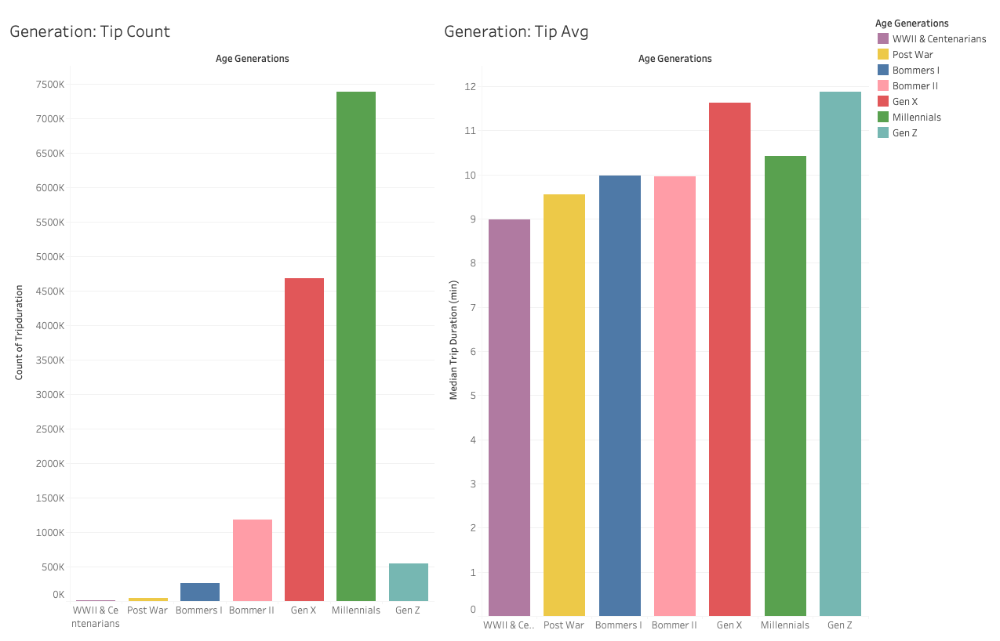
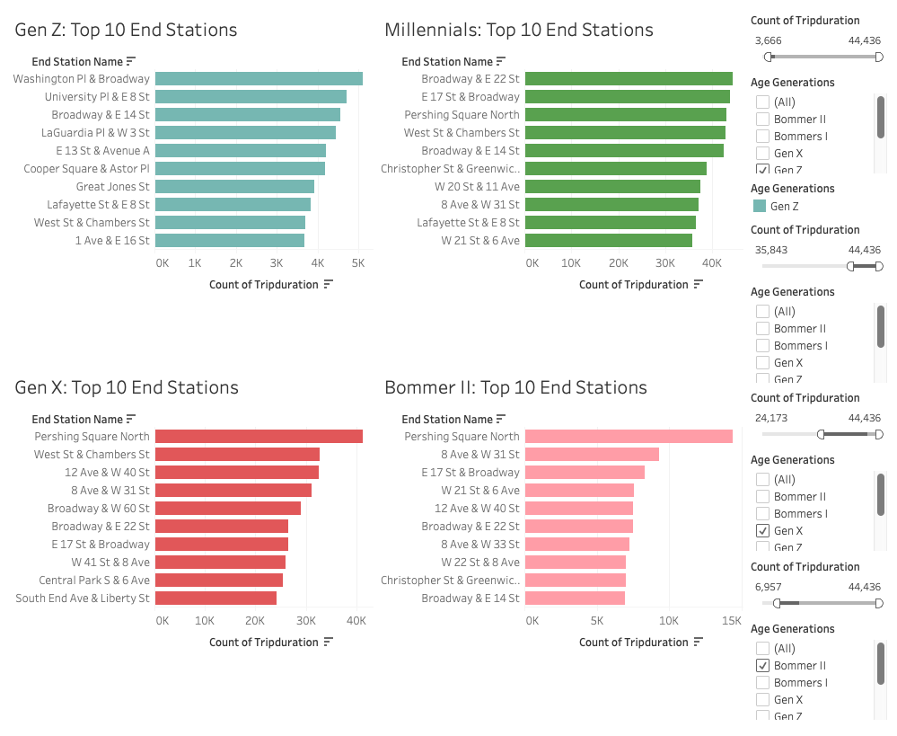
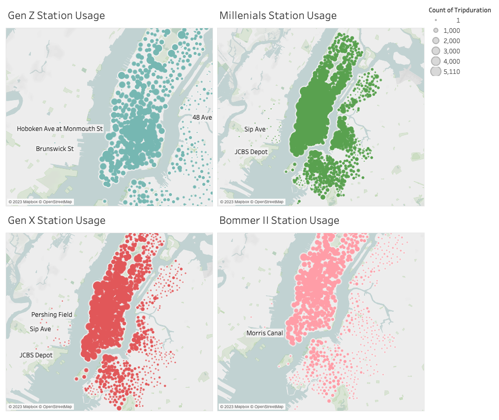
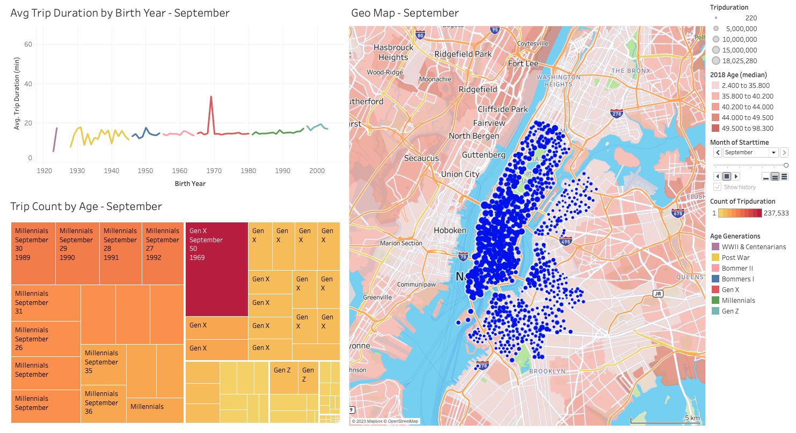
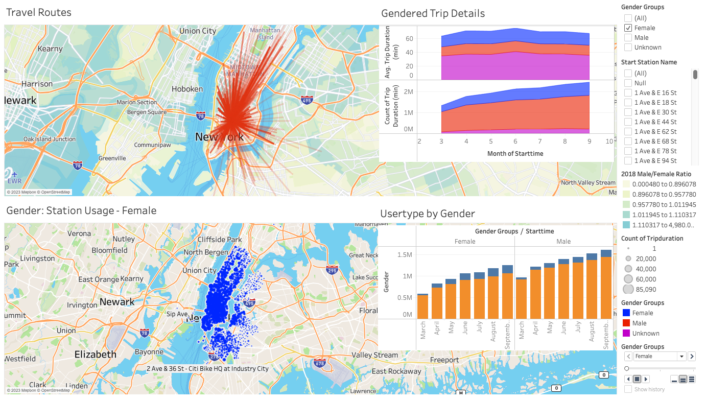

# 2019 NYC Citi Bike Analysis

## Instroduction

New York Citi Bike is the largest bike share program in the US. Collecting data since 2013. In the hypothetical case, no regular reporting is made and city officals have questions about the programs, here are preliminary reports using dashboards from Tableau. 

A link to the full Tableau analysis is [here](https://public.tableau.com/app/profile/ronald.lam/viz/2019NYCCitiBikeAnalysis/2019CitiBikeUnderstandingGender).

## Results

## Usage by Age Group

Millennials as the most the frequented users, over 60% more than the next closest age group (Gen X). This could be because Gen X being slightly older than Millennials, could have aged out of cycling with median trip time 11% higher than Millennials. The older generations take significantly less trips as the city streets can be intimidating and only short trips are viable. Gen Z is still quite young and new to the cycling experience therefore spend a little more time to get from point A to point B, but could be a growing number of users as they grow older.

## Top 10: End Stations by Age Group

These high use stations indicate the age demographic in these areas. This can aid Citi Bikes in two ways. First, maintenance and checks will need to be implemented more regularly. Second, station expansions may need to be considered. Third, partnerships with local businesses can be fostered to aid programming that can align and/or incentives other age groups. 

## Station Usage by Age Group

Millennials occupy large areas off the western coast of Queens and Brooklyn signalling a large population of Millennials in these areas. Also, Gen X is the second largest age group fallout those areas. Looking at Gen Z, there is a concentration of usage around New York University, its residences just west to north west and further west to the trendy East Village area. 

## Station Usage Between March to September 2019

Gen X, particularly aged 50 individuals make great use of of the Citi Bikes. Through the months of March to September of 2019, they are the highest users in number of trips. Seeking their feedback will be worthwhile to improve Citi Bike programming and infrastructure for the Bronx and other areas. Using the dynamic map we can understand the change over time of the stations being used. This will inform action plans on areas in need of additional bikes and stations and bike relocation to rebalance stations. 

## Understanding Gendered Usage

There is a steady increase in both male and female customers and subscribers. However, the Usertype chart indicates by September male subscriptions are 37% higher than that of female subscribers. On the other hand, there are almost 20% more female customers than male customers. Although weather doesn't seem to be a big factor as both average trip duration and count of trips directly correlate between males and females, one possible reason for the lack of subscription is the unsafe roads and lack of cycling infrastructure. Further understanding of cycle routes by gender start stations can be understood by interacting with the Travel Routes dynamic map. 

## Summary

